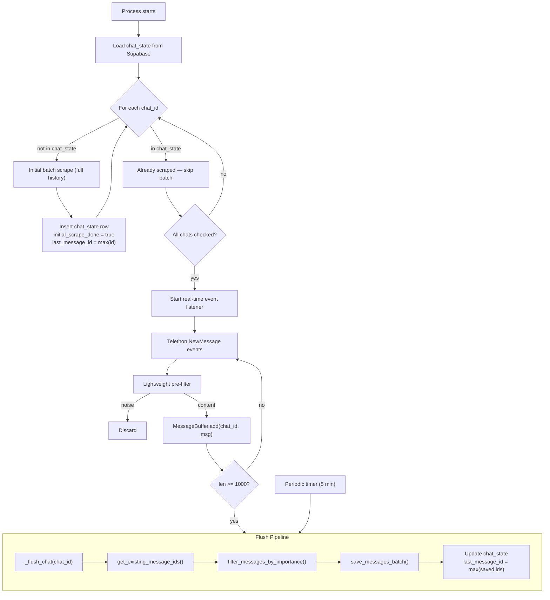

# Feature: Real-time Message Ingestion with Buffered Flush

## Overview

Introduce a two-mode scraping architecture: a **one-shot batch job** that fetches the full history of a new Telegram group, and a **real-time event listener** that continuously buffers incoming messages and flushes them through the existing pipeline. A new `chat_state` table in Supabase tracks which groups have been initially scraped and persists the last saved message ID per chat, so the system always knows where to resume — even after crashes, `SIGINT`, `SIGTERM`, or `kill`.

## Problem Statement

The current scraper in `main.py` runs as a manual one-shot batch job:

```python
async with client:
    for chat_id in CHAT_IDS:
        await scrape_channel(chat_id=chat_id, ...)
```

This has several limitations:

- **Stale data** — New messages are only indexed when someone manually runs the scraper.
- **No resume point** — `max_id` is printed to the console (`📍 To resume from where you left off, use max_id=...`) but never persisted. If the process crashes mid-scrape, you lose the checkpoint.
- **No distinction between "new group" and "already scraped"** — Every run re-queries all existing IDs from the DB and re-iterates from the top. There's no way to know whether a group needs a full history fetch or just recent messages.
- **No continuous operation** — There's no long-running process that keeps the knowledge base up to date.

Additionally, processing every incoming message in real-time through the AI filter would be expensive (GPT-4o-mini call per message) and inefficient (the AI filter works better in batches where it can see conversation context).

## Solution: Two-Mode Architecture with Chat State

### High-Level Flow



### 1. Chat State Table

A new Supabase table that tracks per-chat scraping progress. This is the single source of truth for "has this chat been scraped?" and "where did we leave off?".

**Migration** (`supabase/migrations/..._create_chat_state.sql`):

```sql
CREATE TABLE IF NOT EXISTS public.chat_state (
    chat_id BIGINT PRIMARY KEY,
    last_message_id BIGINT NOT NULL DEFAULT 0,
    initial_scrape_done BOOLEAN NOT NULL DEFAULT FALSE,
    updated_at TIMESTAMPTZ NOT NULL DEFAULT now()
);
```

**Columns:**

| Column | Type | Purpose |
|---|---|---|
| `chat_id` | `BIGINT` PK | Absolute Telegram chat ID (e.g. `1002852524410`) |
| `last_message_id` | `BIGINT` | Highest message ID that has been successfully saved to `messages`. Both the batch scraper and the real-time buffer updater write here after each successful save. |
| `initial_scrape_done` | `BOOLEAN` | `true` once the full-history batch scrape completes. The real-time listener checks this on startup to decide whether to run the batch job first. |
| `updated_at` | `TIMESTAMPTZ` | Auto-updated timestamp for observability. |

**Why `last_message_id` survives any failure:**
- It is written to Supabase (durable storage) after every successful `save_messages_batch` call — not at the end of the entire scrape.
- If the process crashes mid-batch, only the unsaved portion is lost. On restart, the scraper resumes from the last persisted `last_message_id`.
- `SIGINT`/`SIGTERM` handlers flush remaining buffers and update `chat_state` before exiting.
- Even without graceful shutdown (e.g. `kill -9`), `last_message_id` is at most one flush-batch behind, since it's updated after every successful save.

### 2. Chat State Helper Functions

```python
def get_chat_state(chat_id: int) -> dict | None:
    """Fetch chat_state row from Supabase. Returns None if chat has never been scraped."""
    result = supabase.table("chat_state").select("*").eq("chat_id", abs(chat_id)).execute()
    return result.data[0] if result.data else None


def upsert_chat_state(chat_id: int, last_message_id: int, initial_scrape_done: bool = True):
    """Atomically update last_message_id and initial_scrape_done."""
    supabase.table("chat_state").upsert({
        "chat_id": abs(chat_id),
        "last_message_id": last_message_id,
        "initial_scrape_done": initial_scrape_done,
        "updated_at": "now()",
    }, on_conflict="chat_id").execute()
```

### 3. Initial Batch Scrape (One-Shot, for New Groups)

Runs once per chat when `chat_state` row is missing or `initial_scrape_done` is `false`. Uses the existing `scrape_channel` pipeline but updates `chat_state` after each successful batch save.

```python
async def initial_scrape(chat_id: int, batch_size: int = 10):
    """Full history scrape for a new chat group."""
    state = get_chat_state(chat_id)

    if state and state["initial_scrape_done"]:
        print(f"Chat {chat_id} already scraped, skipping initial fetch")
        return

    resume_from = state["last_message_id"] if state else None

    existing_ids = get_existing_message_ids(chat_id)
    new_messages = await fetch_channel_messages(
        chat_id, existing_ids, max_id=resume_from, limit=None
    )

    if not new_messages:
        upsert_chat_state(chat_id, resume_from or 0, initial_scrape_done=True)
        return

    valuable = filter_messages_by_importance(new_messages, batch_size=20)
    save_messages_batch(valuable, batch_size=batch_size)

    highest_id = max(msg["id"] for msg in valuable) if valuable else (resume_from or 0)
    upsert_chat_state(chat_id, highest_id, initial_scrape_done=True)
```

On startup, the main entry point iterates over `CHAT_IDS` and runs `initial_scrape` for any that haven't been fully scraped yet. Once all initial scrapes are done, it transitions to the real-time listener.

### 4. MessageBuffer (Real-time Accumulator)

The core component — an async-safe in-memory buffer with per-chat message lists, a configurable flush threshold, and a periodic background flush for low-traffic chats. After each flush, it updates `chat_state.last_message_id`.

```python
from collections import defaultdict
import asyncio


class MessageBuffer:
    def __init__(self, flush_threshold: int = 1000, flush_interval_seconds: int = 300):
        self.buffer: dict[int, list[dict]] = defaultdict(list)
        self.flush_threshold = flush_threshold
        self.flush_interval = flush_interval_seconds
        self.lock = asyncio.Lock()

    async def add(self, chat_id: int, message: dict):
        async with self.lock:
            self.buffer[chat_id].append(message)

            if len(self.buffer[chat_id]) >= self.flush_threshold:
                await self._flush_chat(chat_id)

    async def _flush_chat(self, chat_id: int):
        """Process and save buffered messages, then update chat_state."""
        messages = self.buffer[chat_id]
        self.buffer[chat_id] = []

        if not messages:
            return

        existing_ids = get_existing_message_ids(chat_id)
        new_messages = [m for m in messages if m["id"] not in existing_ids]
        valuable = filter_messages_by_importance(new_messages, batch_size=20)
        save_messages_batch(valuable, batch_size=10)

        if valuable:
            highest_id = max(msg["id"] for msg in valuable)
            upsert_chat_state(chat_id, highest_id)

    async def flush_all(self):
        """Flush every chat buffer. Called on graceful shutdown."""
        async with self.lock:
            for chat_id in list(self.buffer.keys()):
                if self.buffer[chat_id]:
                    await self._flush_chat(chat_id)

    async def periodic_flush(self):
        """Background task to flush all buffers periodically."""
        while True:
            await asyncio.sleep(self.flush_interval)
            await self.flush_all()
```

### 5. Telethon Event Handler

Wires the buffer into Telethon's real-time message stream. The message dict matches the structure used throughout `src/scraper/` — same keys as `fetch_channel_messages` produces.

```python
buffer = MessageBuffer(flush_threshold=1000, flush_interval_seconds=300)

@client.on(events.NewMessage(chats=CHAT_IDS))
async def handler(event):
    msg = event.message
    if msg.text and msg.text.strip() and should_buffer(msg.text):
        raw_id = str(abs(event.chat_id))
        if raw_id.startswith("100"):
            raw_id = raw_id[3:]

        await buffer.add(
            chat_id=abs(event.chat_id),
            message={
                "id": msg.id,
                "chat_id": abs(event.chat_id),
                "author": msg.sender_id,
                "text": msg.text,
                "link": f"https://t.me/c/{raw_id}/{msg.id}",
                "reply_to_message_id": msg.reply_to_msg_id,
            }
        )
```

### 6. Lightweight Pre-filter

A cheap local filter that runs before messages enter the buffer, discarding obvious noise so the AI filter receives less junk:

```python
import re

SKIP_PATTERNS = [
    r"^(да|нет|ок|спс|👍|😂)$",
    r"^@\w+$",
    r"^\+$",
]

def should_buffer(text: str) -> bool:
    if len(text) < 3:
        return False
    for pattern in SKIP_PATTERNS:
        if re.match(pattern, text, re.IGNORECASE):
            return False
    return True
```

Intentionally conservative — only filters messages that are unambiguously noise. All importance decisions for borderline messages remain with the AI filter.

### 7. Graceful Shutdown (Signal Handlers)

Ensures `last_message_id` is always persisted, even on `Ctrl+C` or `docker stop`:

```python
import signal

def setup_signal_handlers(buffer: MessageBuffer, loop: asyncio.AbstractEventLoop):
    """Register handlers that flush buffers before exiting."""

    def shutdown(sig, frame):
        print(f"\nReceived {signal.Signals(sig).name}, flushing buffers...")
        loop.run_until_complete(buffer.flush_all())
        print("Buffers flushed, exiting.")
        raise SystemExit(0)

    signal.signal(signal.SIGINT, shutdown)
    signal.signal(signal.SIGTERM, shutdown)
```

**Resilience guarantees:**

| Scenario | What happens to `last_message_id` |
|---|---|
| Normal `Ctrl+C` / `SIGINT` | Signal handler flushes all buffers → `chat_state` updated → clean exit |
| `docker stop` / `SIGTERM` | Same as above — `SIGTERM` handler fires |
| `kill -9` / power loss | `chat_state` is at most one flush-batch behind (updated after every `save_messages_batch`) |
| Exception in flush pipeline | `chat_state` not updated for that flush → messages re-processed on next flush (dedup via `get_existing_message_ids` prevents duplicates) |

### 8. Main Entry Point

Ties everything together:

```python
async def main():
    CHAT_IDS = [-1001557871268, -1002852524410, -1002842855377, -1001854607533, -1002188551081]

    async with client:
        # Phase 1: Initial scrape for any new groups
        for chat_id in CHAT_IDS:
            await initial_scrape(chat_id)

        # Phase 2: Start real-time listener
        buffer = MessageBuffer(flush_threshold=1000, flush_interval_seconds=300)
        setup_signal_handlers(buffer, asyncio.get_event_loop())
        asyncio.create_task(buffer.periodic_flush())

        # Register event handler (see section 5)
        # ...

        print("Listening for new messages...")
        await client.run_until_disconnected()
```

## Cost Analysis

| Approach | AI Calls | Tokens (approx) |
|---|---|---|
| Real-time (per message) | 1000 calls | ~500K tokens |
| Batched (1000 -> 50 batches of 20) | 50 calls | ~50K tokens |

The batched approach is roughly **10-20x cheaper** and actually produces better results because the AI can see message context (reply chains, conversation flow) within each batch.

## Key Design Decisions

| Aspect | Decision | Rationale |
|---|---|---|
| State storage | Supabase `chat_state` table | Durable, survives any process failure, shared across deployments |
| `last_message_id` updates | After every `save_messages_batch` | Minimizes data loss window — at most one batch behind on hard crash |
| Initial vs continuous | Separate code paths | Batch scrape uses `iter_messages` (history); real-time uses `events.NewMessage` (live) |
| Flush threshold | 1000 messages per chat | Balances cost efficiency with data freshness |
| Time-based flush | Every 5 minutes | Ensures low-traffic chats don't sit in the buffer indefinitely |
| Per-chat buffers | Separate `list` per `chat_id` | One busy chat doesn't delay or block others from being flushed |
| Pre-filter | Local regex, < 3 chars | Filters obvious noise cheaply; conservative to avoid losing valuable short replies |
| Concurrency | `asyncio.Lock` on buffer | Prevents race conditions between the event handler and periodic flush |
| Fail-open | Keep all messages on AI error | Matches existing behavior in `filter_messages_by_importance` |

## Integration with Existing Pipeline

The flush pipeline reuses the exact same functions from `src/scraper/`:

1. **`get_existing_message_ids(chat_id)`** — Query Supabase `messages` table for IDs already saved (batched queries of 1000).
2. **`filter_messages_by_importance(messages, batch_size=20)`** — Send batches of 20 to GPT-4o-mini with reply chain context. Auto-expands kept set to preserve complete reply threads.
3. **`save_messages_batch(valuable, batch_size=10)`** — Generate embeddings via `text-embedding-3-small`, upsert into `messages` table with composite PK `(id, chat_id)`.

No changes to these existing functions are needed. The buffer and initial scrape act as new entry points that call the same pipeline.

## New Files

| File | Description |
|---|---|
| `supabase/migrations/..._create_chat_state.sql` | Migration to create `chat_state` table |
| `src/scraper/chat_state.py` | `get_chat_state()` and `upsert_chat_state()` helpers |
| `src/realtime/message_buffer.py` | `MessageBuffer` class with add, flush, periodic flush |
| `src/realtime/pre_filter.py` | `should_buffer()` local noise filter |
| `src/realtime/initial_scrape.py` | `initial_scrape()` — one-shot batch job for new groups |
| `src/realtime/signal_handlers.py` | `setup_signal_handlers()` for graceful shutdown |
| `src/realtime/main.py` | Entry point: initial scrape + event listener + buffer |
| `src/realtime/__init__.py` | Package exports |

## Modified Files

| File | Change |
|---|---|
| `main.py` | Update to call `src/realtime/main.py` instead of the old batch loop |

## Open Questions / Future Work

- **Buffer persistence** — The in-memory buffer is lost on `kill -9`. For even stronger guarantees, consider writing buffer contents to a local JSON file or Redis on each `add()`. For now, the `chat_state.last_message_id` approach limits data loss to at most one flush window.
- **Question backfill integration** — Currently question generation runs as a separate script (`scripts/backfill_questions/`). The flush pipeline could trigger question generation for newly saved messages inline, or a separate watcher could poll for messages missing questions.
- **Dynamic threshold** — Adjust flush threshold based on chat activity. Very active chats could flush at 500; quiet chats rely on the time-based flush.
- **Monitoring** — Log buffer sizes, flush frequency, and AI filter ratios to track health. Could emit to the existing `bot_interactions` table or a new metrics table.
- **Adding new groups at runtime** — Currently `CHAT_IDS` is hardcoded. A future enhancement could read from the `chat_state` table plus a config, allowing new groups to be added without redeploying.
